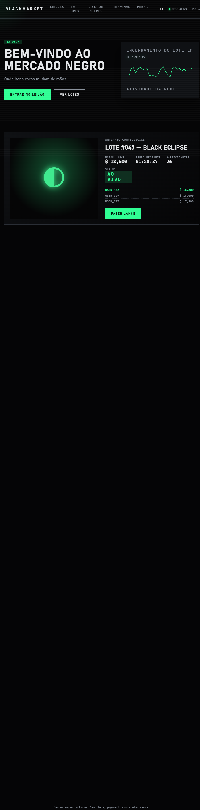
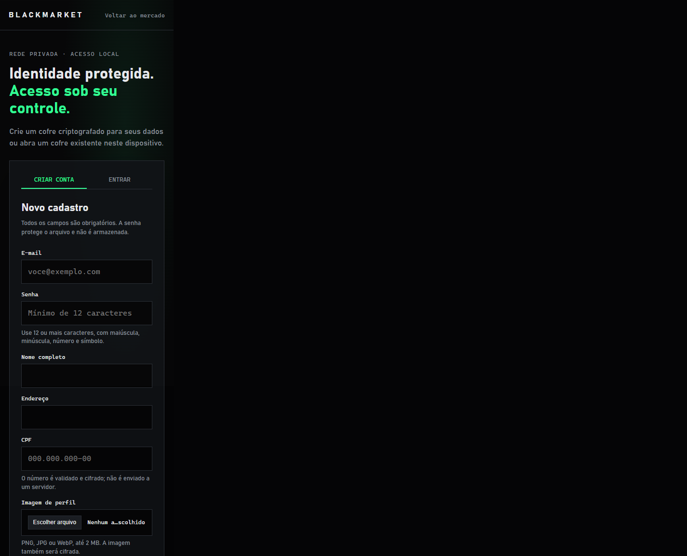

# BLACKMARKET AUCTIONS

### Um mercado negro fictício de leilões com estética de terminal e interface em português.

	
	
	

<a href="https://instagram.com/ghsantos_i">Instagram: @ghsantos_i</a>

## Sobre o projeto

O BLACKMARKET é uma demonstração front-end de uma rede privada de leilões fictícios. A página reúne lotes ao vivo, contagens regressivas, lista de interesse, atividade simulada e um terminal interativo, tudo em uma interface responsiva.

## Telas

### Mercado

Veja lotes em andamento e futuros, acompanhe lances e abra os detalhes de cada item.

### Cadastro e acesso

O formulário valida os campos e permite criar ou abrir um cofre local criptografado.

## Recursos

- Lotes fictícios com status e contagem regressiva.
- Lances simulados e histórico de ofertas.
- Lista de interesse salva neste navegador.
- Feed de atividade e terminal com comandos em português.
- Layout responsivo para telas menores.
- Cadastro local com validação de e-mail, CPF e senha.
- Exportação dos dados do cadastro em arquivo `.txt` criptografado com Web Crypto.

## Como abrir

1. Baixe ou clone este repositório.
2. Abra `index.html` em um navegador moderno.
3. Selecione **Entrar / criar conta** para acessar a tela de cadastro.

Não é necessário instalar dependências ou iniciar um servidor para navegar pela demonstração. Para usar criptografia no cadastro, o navegador precisa oferecer suporte a `crypto.subtle`; HTTPS ou `localhost` são recomendados.

## Tecnologias

HTML, CSS e JavaScript sem bibliotecas externas.

## Aviso

Este projeto é apenas uma demonstração local: não existe servidor, autenticação real, pagamento ou item verdadeiro. Os lances são temporários e não são compartilhados. O cadastro exporta um cofre criptografado para o computador; o arquivo e a senha devem ser guardados com segurança. Não use dados pessoais reais nesta demonstração.

## Contato

Instagram: [@ghsantos_i](https://instagram.com/ghsantos_i)
